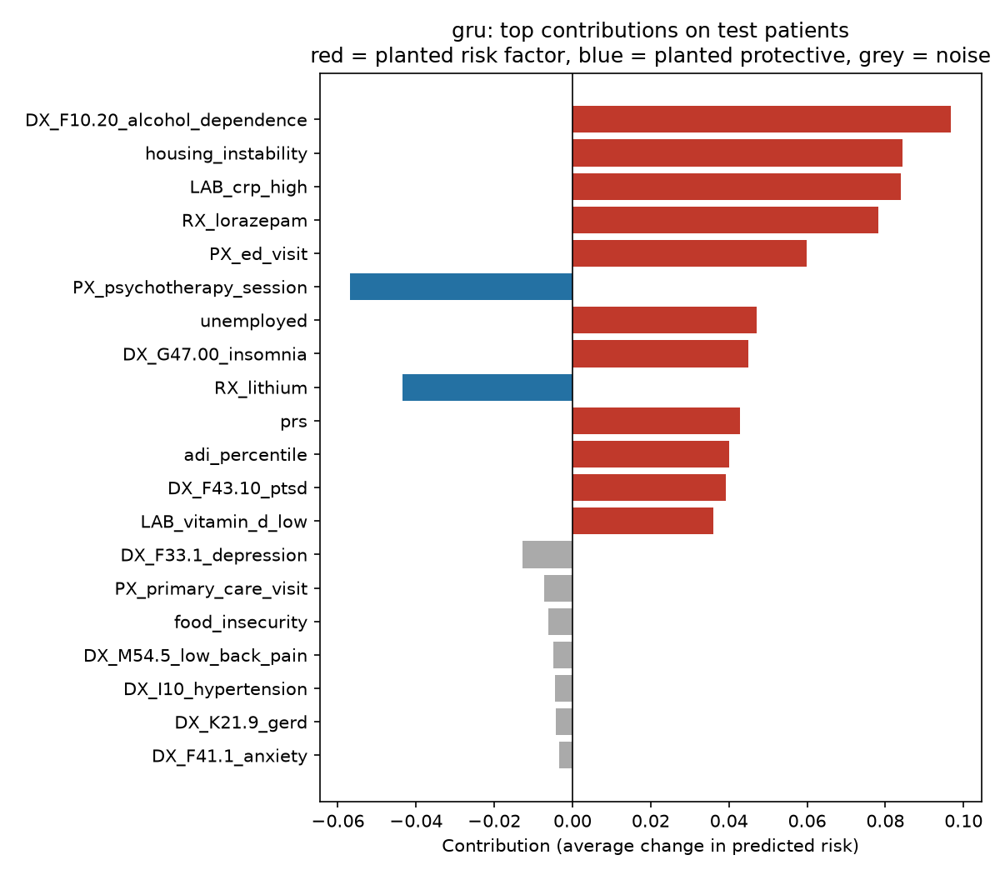

# DeepBiomarker: Interpretable Deep Learning on Longitudinal EHR, Social Determinants, and Genetics

Predicting psychiatric hospitalization from patients' visit histories (diagnoses, medications, abnormal labs,
procedures), social determinants of health (SDoH), and a polygenic risk score, then identifying which factors
drive risk with perturbation-based contribution analysis.

> **This is an independent, from-scratch reimplementation** of the approach behind the DeepBiomarker studies
> (citations below), built on synthetic data so the code can be shared publicly. It is not the original study
> code, which is not public because of data-use restrictions, and its results are not comparable to the
> published results.

> **Findings:** (1) Each data type added predictive value: visit history alone reached AUROC 0.790, adding SDoH
> 0.804, and adding a polygenic risk score 0.816, matching the theoretical ceiling. (2) A GRU sequence model learned
> the importance of recent events on its own but trailed a logistic regression with one hand-engineered recency
> feature (0.790 vs 0.816). (3) Perturbation-based explanations from both models recovered all 13 planted risk and
> protective factors with correct direction, and correctly ignored a correlated decoy.

## Background

The DeepBiomarker studies used deep learning on electronic medical records (EMR) from 38,807 patients with PTSD
at the University of Pittsburgh Medical Center to predict suicide-related events, identifying important lab tests,
medications, and diagnoses with perturbation-based contribution analysis. DeepBiomarker2 extended the approach to
alcohol and substance use disorder risk and added multiple social determinants of health.

This repository reproduces the approach end to end on synthetic data, adds a polygenic risk score, and does
something the original data could not support: it checks the explanations against known ground truth.

## Why synthetic data with planted ground truth

With real patients, nobody knows the true risk factors, so explanations cannot be verified. Here the outcome is
generated from a known set of factors:

| Type | Planted risk factors | Planted protective factors | Decoys / noise |
|---|---|---|---|
| Visit history | alcohol dependence, lorazepam, high CRP, ED visits, insomnia, low vitamin D, PTSD | psychotherapy, lithium | 26 other codes |
| SDoH | area deprivation index, housing instability, unemployment | | food insecurity (correlated with deprivation, no direct effect), rural residence |
| Genetics | polygenic risk score | | |

Timing matters: events in the last 180 days count fully, older events at 30%. The cohort has 50,000 patients
(574,794 visits; 17.1% outcome prevalence), split by patient into 70% train, 15% validation, and 15% test.

## Models

- **Logistic regression** on code flags ("ever in 3 years" and "in the last 180 days") plus patient-level features
- **GRU sequence model** in the style of pytorch_ehr and Med-BERT (Zhi lab): each visit is the sum of learned code
  embeddings plus time before the index date; a GRU reads visits in order, and its final state is combined with
  patient-level features. Early stopping uses the validation set; the test set is used once.

## Results (test set, 7,500 patients)

**Prediction and the incremental value of each data type**

| Model | Visit history | + SDoH | + SDoH + PRS |
|---|---|---|---|
| Logistic regression, "ever" flags | 0.730 | 0.749 | 0.763 |
| Logistic regression, "ever" + "recent" flags | 0.790 | 0.804 | **0.816** |
| GRU with visit timing | 0.761 | 0.778 | 0.790 |
| Oracle (true risk; the ceiling) | | | 0.816 |

AUROC shown. AUPRC for the full feature set: logistic regression 0.547, GRU 0.495, oracle 0.548.

- **SDoH and genetics each add value** on top of clinical history, for both model types (about +0.015 AUROC for
  SDoH and +0.012 for the PRS).
- **Timing matters.** Adding a recency flag raised logistic regression from 0.763 to 0.816. In a controlled
  ablation, the GRU with visit timing beat the same GRU given only visit order (0.790 vs 0.781 AUROC; AUPRC 0.495
  vs 0.457), so it learned part of the timing signal on its own.
- **Domain-informed engineering beat deep learning here.** The risk structure is simple, so one well-chosen feature
  let a linear model reach the ceiling. A sequence model earns its place when temporal patterns are too complex to
  hand-engineer.

**Do the explanations recover the true risk factors?**

| Model | Precision@13 | Correct direction | Spearman vs truth |
|---|---|---|---|
| Logistic regression | 1.00 | 13/13 | 0.82 |
| GRU | 1.00 | 13/13 | 0.82 |

Precision@13: of the 13 factors ranked highest by perturbation-based contribution, the share that are real planted
factors. Both models ranked all 13 true factors at the top, identified psychotherapy and lithium as protective,
and did not credit the food-insecurity decoy despite its correlation with neighborhood deprivation.



Contributions are changes in predicted probability, so they also reflect who carries a factor: housing
instability ranks high partly because it occurs in already higher-risk, deprived neighborhoods. This is one reason
contribution rankings should be read as "importance in this population," not as causal effect sizes.

## Lessons from building it

- **Small evaluation sets mislead.** At 10,000 patients (1,500 per split), even the oracle scored 0.80 on
  validation and 0.84 on test. Differences between models were within that noise, so the cohort was scaled to
  50,000 before comparing models.
- **Ablations make claims testable.** "The GRU learns timing" was checked by removing timing and measuring the drop.

## Responsible AI: subgroup audit and model card

A model can look good overall and still fail a group of patients, so every model is audited by sex, age group,
neighborhood deprivation, and housing instability for discrimination (AUROC with bootstrap 95% intervals) and
calibration (observed/expected events and calibration slope). The full results are in
`results/subgroup_audit.csv`, and a [model card](MODEL_CARD.md) documents intended use, out-of-scope uses, data,
performance, subgroup results, and ethical considerations.

| Model | Overall observed/expected | Subgroup range | Finding |
|---|---|---|---|
| Logistic regression, with SDoH | 1.00 | 0.94-1.05 | Well calibrated in every group |
| Logistic regression, without SDoH | 1.00 | **0.75-1.45** | Looks perfect overall, but under-predicts risk by 30% in high-deprivation neighborhoods and 45% for patients with housing instability |
| GRU | **0.83** | 0.79-0.86 | Over-predicts risk by 17% for every group: selected on AUROC, which ignores calibration |
| GRU, recalibrated on the validation set | 1.02 | 0.96-1.07 | Platt scaling fixed calibration; AUROC unchanged |

Two lessons: overall calibration can hide large subgroup miscalibration that AUROC does not reveal, and
discrimination and calibration are different properties, so a model selected on AUROC should be recalibrated
before its probabilities are used. Because the data are synthetic, these results demonstrate the audit method,
not the size of real-world disparities.

## How to run

```bash
pip install -r requirements.txt
pip install -e .
pytest                                                   # 8 tests, including recovery of planted factors
python -m deepbiomarker.generate --n-patients 50000      # synthetic cohort (reproducible, fixed seed)
python -m deepbiomarker.baseline                         # logistic regression, all feature sets
python -m deepbiomarker.model --features ehr_sdoh_prs    # GRU (also: --features ehr, ehr_sdoh; --no-time)
python -m deepbiomarker.contributions                    # perturbation-based contribution analysis
python -m deepbiomarker.audit                            # subgroup audit, recalibration, model card
```

Each GRU run takes under a minute on a laptop CPU.

## Limitations

- Synthetic data with a simple, additive risk structure; real EHR has messier coding, missing data, interactions,
  and confounding, so real-world performance and explanation fidelity would be lower.
- SDoH are simulated patient-level values; DeepBiomarker2 used community-level SDoH linked by location.
- The polygenic risk score is simulated as a single standardized value; real scores require genotype data,
  ancestry-aware construction, and calibration across populations.
- Contribution analysis identifies predictive importance, not causation.

## Citation

This reimplementation is based on the approach described in:

Miranda O, Fan P, Qi X, Yu Z, Ying J, Wang H, Brent DA, Silverstein JC, Chen Y, Wang L. DeepBiomarker: Identifying
Important Lab Tests from Electronic Medical Records for the Prediction of Suicide-Related Events among PTSD
Patients. *Journal of Personalized Medicine.* 2022;12(4):524. https://doi.org/10.3390/jpm12040524

Miranda O, Fan P, Qi X, Wang H, Brannock MD, Kosten TR, Ryan ND, Kirisci L, Wang L. DeepBiomarker2: Prediction of
Alcohol and Substance Use Disorder Risk in Post-Traumatic Stress Disorder Patients Using Electronic Medical Records
and Multiple Social Determinants of Health. *Journal of Personalized Medicine.* 2024;14(1):94.
https://doi.org/10.3390/jpm14010094

The visit-embedding sequence model follows ideas from [pytorch_ehr](https://github.com/ZhiGroup/pytorch_ehr) and
[Med-BERT](https://github.com/ZhiGroup/Med-BERT) (Zhi lab); no code from those repositories is included.

## Project structure

```
src/deepbiomarker/generate.py        synthetic cohort with planted risk factors, SDoH, and PRS
src/deepbiomarker/dataset.py         patient-level splits, vocabulary, features, visit sequences
src/deepbiomarker/baseline.py        logistic regression baselines across feature sets
src/deepbiomarker/model.py           GRU over visit embeddings
src/deepbiomarker/contributions.py   perturbation-based contribution analysis scored against ground truth
```

## Author

**Oshin Miranda, PhD** | [LinkedIn](https://www.linkedin.com/in/oshin-miranda-ph-d-9551781b5/) | [Google Scholar](https://scholar.google.com/citations?hl=en&user=fkvhYbgAAAAJ&view_op=list_works&sortby=pubdate)
